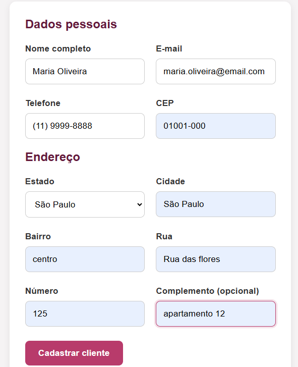
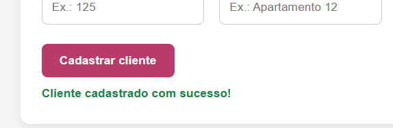
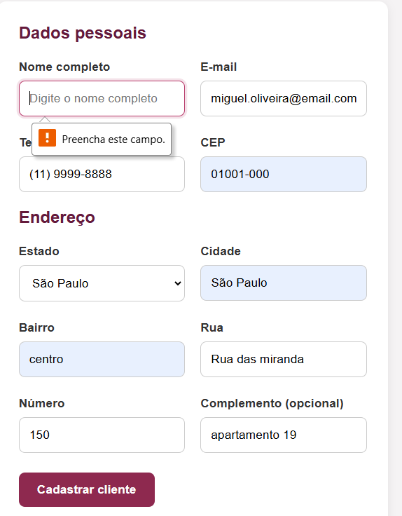
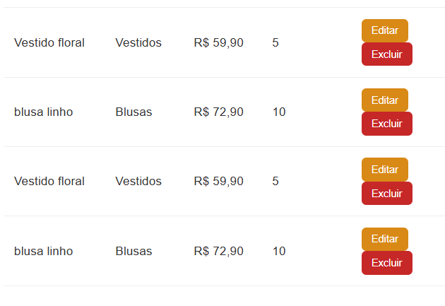
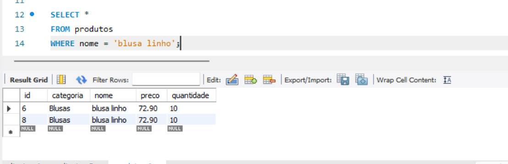
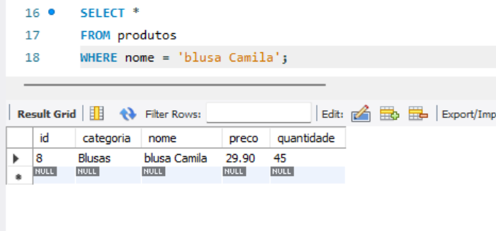
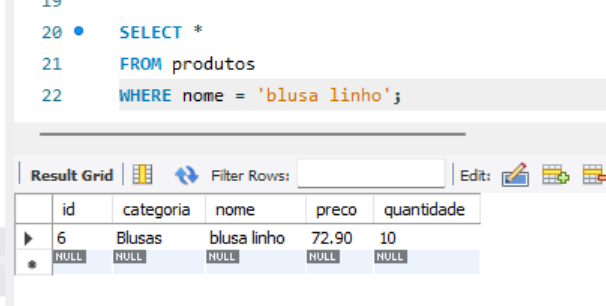

# 📸 Evidências de Testes — ModaFácil

Esta pasta contém as evidências das execuções dos casos de teste documentados no projeto.

## CT-001 — Cadastro de cliente com dados válidos

- Formulário preenchido
- Confirmação de cadastro realizado com sucesso
- Validação da persistência dos dados através de SQL

---

## 📸 Evidências — CT-001

### Evidência 01 — Formulário preenchido

### Evidência 02 — Cadastro realizado com sucesso

### Evidência 03 — Validação no banco de dados

Consulta SQL realizada para confirmar a persistência dos dados cadastrados.

.png)

---

## CT-002 — Validação de campo obrigatório

### Evidência 01 — Nome completo obrigatório

O sistema impediu o cadastro e apresentou a mensagem **“Preencha este campo.”** quando o campo **Nome completo** foi deixado vazio.

**Resultado: ✅ APROVADO**

---

## 🐞 BUG-001 — Cadastro duplicado de produto

Durante os testes no módulo **Produtos**, foi identificado que o sistema permite cadastrar novamente um produto já existente, criando registros distintos em vez de atualizar a quantidade em estoque.

### 📸 Evidência 01 — Produtos duplicados na listagem

A listagem apresenta o mesmo produto cadastrado mais de uma vez.

### 🗄️ Evidência 02 — Validação no banco de dados

A consulta SQL confirmou que os produtos duplicados foram persistidos como registros distintos no banco de dados.

**Resultado: 🐞 DEFEITO IDENTIFICADO**

➡️ Consulte a documentação completa em [`bugs.md`](../bugs.md)

---

## CT-003 — Edição de produto com dados válidos

Foi realizada a edição do produto **blusa Camila** e posteriormente validada a persistência das alterações no banco de dados.

### 📸 Evidência 01 — Produto editado

Após salvar as alterações, o produto foi apresentado na aplicação com **preço R$ 29,90** e **quantidade 45**.

### 🗄️ Evidência 02 — Validação no banco de dados

A consulta SQL confirmou que as alterações realizadas na aplicação foram persistidas corretamente no banco de dados.

**Resultado: ✅ APROVADO**
